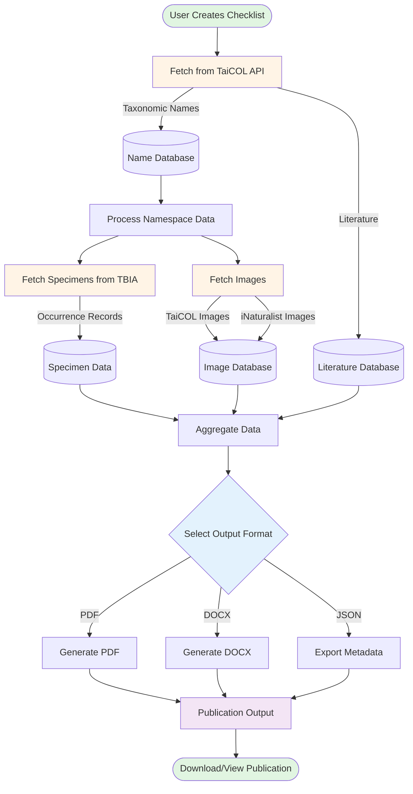

# Biota - Taxonomic Publication System

## Overview

**Biota** is a Flask-based taxonomic data management and publication system designed for biological specimen collections and nomenclature handling. The application integrates multiple biodiversity data sources to create comprehensive taxonomic checklists and generate publication-ready documents in multiple formats.

## Purpose

Biota streamlines the creation of scientific taxonomic publications by:
- Aggregating taxonomic nomenclature data from authoritative sources
- Consolidating specimen occurrence records from major biodiversity databases
- Enriching taxonomic information with images and metadata
- Generating formatted publications following scientific conventions

## Key Features

### 1. **Multi-Source Data Integration**
- **TaiCOL (Taiwan Catalogue of Life)**: Authoritative taxonomic names, synonyms, and nomenclatural references
- **TBIA (Taiwan Biodiversity Information Alliance)**: Specimen occurrence data including TaiBIF and GBIF records
- **iNaturalist**: Community-sourced taxon images and observations
- **GBIF (Global Biodiversity Information Facility)**: Global occurrence data

### 2. **Taxonomic Data Management**
- Scientific name validation and authority management
- Synonym handling and nomenclatural relationships
- Type specimen documentation
- Literature citation tracking
- Common name management (multilingual)

### 3. **Specimen Data Processing**
- Automatic locality standardization (Taiwan counties)
- Collector and collection number tracking
- Herbarium/museum accession management
- Coordinate and elevation data handling

### 4. **Publication Generation**
- **PDF**: Publication-quality documents with custom fonts (NotoSerifTC, Tinos)
  - Single and two-column layouts
  - Proper scientific name formatting (italics, authorities)
  - Structured sections (description, distribution, specimens, notes)
- **DOCX**: Microsoft Word compatible documents
  - Multi-column support
  - Styled taxonomic formatting
- **Structured Metadata**: JSON/API output for data exchange

### 5. **User Management**
- Personal collection workspaces
- Publication authorship tracking
- Namespace-based organization (TaiCOL integration)

## System Architecture

### Technology Stack
- **Backend**: Flask (Python)
- **Databases**:
  - PostgreSQL (SQLAlchemy ORM) - Application data
  - MySQL (PyMySQL) - Legacy TaiCOL data
- **Document Generation**:
  - ReportLab (PDF)
  - python-docx (DOCX)
- **External APIs**: REST API integrations
- **Deployment**: Docker, Gunicorn

### Core Components

```
┌─────────────────────────────────────────────────────────────────┐
│                        Biota Application                         │
└─────────────────────────────────────────────────────────────────┘
         │
         ├── Flask Application (application.py)
         │   ├── Blueprints
         │   │   ├── main.py (API endpoints, data retrieval)
         │   │   └── publication.py (Publication management)
         │   └── Models (models.py)
         │       ├── User, Collection, Publication
         │       ├── Item, ItemSynonym
         │       └── PublicationLiterature
         │
         ├── Database Layer (database.py)
         │   ├── PostgreSQL (biota) - SQLAlchemy
         │   └── MySQL (taicol) - PyMySQL
         │
         ├── Business Logic (helpers.py)
         │   ├── get_namespace_data() - Data aggregation
         │   ├── generate_pdf() - PDF generation
         │   ├── generate_docx() - DOCX generation
         │   └── TBIASpecimens - Specimen data fetching
         │
         └── External Integrations
             ├── TaiCOL API
             ├── TBIA API
             ├── GBIF API
             └── iNaturalist API
```

## Data Flow



## Workflow

### 1. Data Collection Phase
```
User Selects TaiCOL Namespace
         ↓
Fetch Taxonomic Checklist
    - Scientific names
    - Synonyms
    - Type specimens
    - Literature citations
         ↓
Query External APIs
    - TBIA: Specimen records
    - iNaturalist: Images
    - GBIF: Occurrence data
         ↓
Store in Collections Database
```

### 2. Data Processing Phase
```
Retrieve Namespace Data
         ↓
Process Taxonomic Information
    - Format scientific names
    - Parse authorities
    - Link synonyms
    - Extract type specimen details
         ↓
Process Specimen Data
    - Standardize localities
    - Group by county/region
    - Format collector information
    - Extract coordinates
         ↓
Aggregate Literature
    - Link citations
    - Format references
```

### 3. Publication Generation Phase
```
Select Publication Format
         ↓
    ┌────┴────┬────────┐
    ↓         ↓        ↓
   PDF      DOCX     JSON
    │         │        │
    ├─ Title page      │
    ├─ Author info     │
    ├─ Literature      │
    ├─ Species list    │
    │  ├─ Names (bold/italic)
    │  ├─ Synonyms
    │  ├─ Descriptions
    │  ├─ Distributions
    │  ├─ Specimens
    │  └─ Notes
    ↓         ↓        ↓
Download Publication
```

## Output Format Examples

### PDF/DOCX Structure
```
┌─────────────────────────────────────────┐
│         Biota Taiwanica                 │
│      Generated: 2026-01-06              │
└─────────────────────────────────────────┘

┌─────────────────────────────────────────┐
│  Publication Title                      │
│  Author Name                            │
│                                         │
│  LITERATURE                             │
│  - Citation 1                          │
│  - Citation 2                          │
└─────────────────────────────────────────┘

┌──────────────────┬──────────────────────┐
│ 1. Genus species │ distribution text... │
│ Author, 1900     │                      │
│ 中文名稱           │ COUNTY: Locality,   │
│                  │ Collector 123.       │
│ Synonym Name     │                      │
│ Reference        │ 2. Next species...   │
│                  │                      │
│ Description...   │                      │
└──────────────────┴──────────────────────┘
```

## Use Cases

1. **Taxonomic Research**: Create comprehensive checklists for flora/fauna studies
2. **Specimen Documentation**: Track and publish specimen collections
3. **Biodiversity Assessments**: Compile occurrence data for conservation planning
4. **Scientific Publications**: Generate publication-ready manuscripts
5. **Data Integration**: Consolidate data from multiple biodiversity databases

## Technical Highlights

- **Dual Database Architecture**: Leverages both modern PostgreSQL and legacy MySQL systems
- **Custom Font Support**: NotoSerifTC for Traditional Chinese, Tinos for scientific names
- **Smart HTML-to-Font Conversion**: Custom solution for italic/bold rendering in PDF
- **Multi-column Layout**: Professional two-column format for species lists
- **Geographic Standardization**: Taiwan county name mapping (Chinese → English)
- **Flexible Output**: PDF, DOCX, and structured metadata formats

## Development & Deployment

```bash
# Development
docker-compose up
flask run --host 0.0.0.0

# Production
WEB_ENV=prod docker-compose up
gunicorn --bind 0.0.0.0:8001 wsgi:app

# Database Management
flask makemigrations "description"
flask migrate
flask createuser <username> <email> <password>
```

## API Endpoints

- `/api/external/names/<source>/<key>` - Search taxonomic names
- `/api/external/data/<source>/<taxon_key>` - Retrieve specimen data
- `/api/namespaces/<namespace_ids>` - Get namespace data
- `/api/publish` - Generate documents
- `/preview` - Preview interface

## Future Enhancements

- Image integration in publications
- Interactive web-based checklist editor
- Bulk data import/export
- Collaborative editing features
- Multi-language support expansion
- Advanced specimen mapping visualization

---

**Biota** bridges the gap between biodiversity data sources and scientific publication, making taxonomic research more efficient and accessible.
