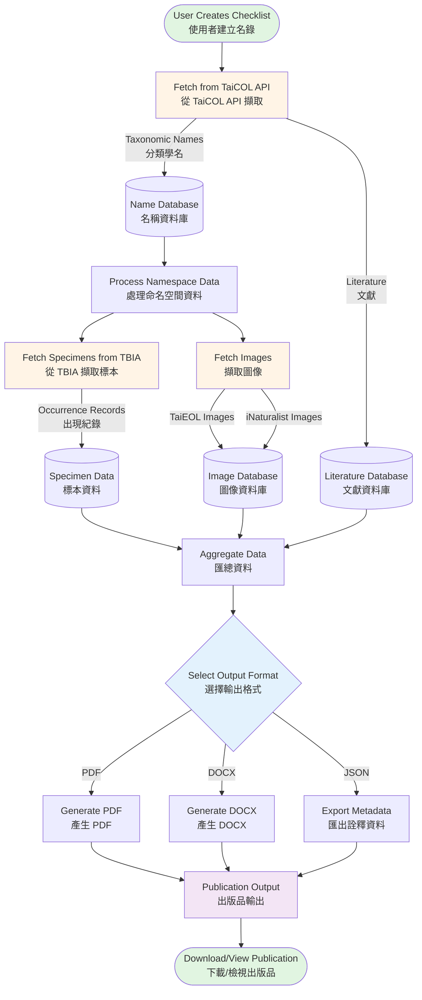

# Biota - Taxonomic Publication System | 分類學出版系統

## Overview | 概述

**Biota** is a Flask-based taxonomic data management and publication system designed for biological specimen collections and nomenclature handling. The application integrates multiple biodiversity data sources to create comprehensive taxonomic checklists and generate publication-ready documents in multiple formats.

**Biota** 是一個基於 Flask 的分類學資料管理與出版系統，專為生物標本蒐藏與命名法處理而設計。本應用程式整合多個生物多樣性資料來源，用以建立完整的分類學名錄，並產生多種格式的出版級文件。

## Purpose | 目的

Biota streamlines the creation of scientific taxonomic publications by:
- Aggregating taxonomic nomenclature data from authoritative sources
- Consolidating specimen occurrence records from major biodiversity databases
- Enriching taxonomic information with images and metadata
- Generating formatted publications following scientific conventions

Biota 透過以下方式簡化科學分類學出版的建立流程：
- 匯集來自權威來源的分類命名資料
- 整合來自主要生物多樣性資料庫的標本出現紀錄
- 以圖像與詮釋資料豐富分類學資訊
- 依循科學慣例產生格式化出版品

## Key Features | 主要功能

### 1. **Multi-Source Data Integration | 多來源資料整合**
- **TaiCOL (Taiwan Catalogue of Life | 台灣物種名錄)**: Authoritative taxonomic names, synonyms, and nomenclatural references | 權威分類學名、異名與命名法參考文獻
- **TBIA (Taiwan Biodiversity Information Alliance | 台灣生物多樣性資訊聯盟)**: Specimen occurrence data including TaiBIF and GBIF records | 標本出現紀錄資料，包含 TaiBIF 與 GBIF 紀錄
- **iNaturalist**: Community-sourced taxon images and observations | 社群來源的分類群圖像與觀察資料
- **GBIF (Global Biodiversity Information Facility | 全球生物多樣性資訊機構)**: Global occurrence data | 全球出現紀錄資料

### 2. **Taxonomic Data Management | 分類學資料管理**
- Scientific name validation and authority management | 學名驗證與命名者管理
- Synonym handling and nomenclatural relationships | 異名處理與命名法關係
- Type specimen documentation | 模式標本文件記錄
- Literature citation tracking | 文獻引用追蹤
- Common name management (multilingual) | 俗名管理（多語言）

### 3. **Specimen Data Processing | 標本資料處理**
- Automatic locality standardization (Taiwan counties) | 自動地點標準化（台灣縣市）
- Collector and collection number tracking | 採集者與採集號追蹤
- Herbarium/museum accession management | 標本館/博物館館號管理
- Coordinate and elevation data handling | 座標與海拔資料處理

### 4. **Publication Generation | 出版品產生**
- **PDF**: Publication-quality documents with custom fonts (NotoSerifTC, Tinos) | 具自訂字型（NotoSerifTC、Tinos）的出版級文件
  - Single and two-column layouts | 單欄與雙欄版面配置
  - Proper scientific name formatting (italics, authorities) | 適當的學名格式化（斜體、命名者）
  - Structured sections (description, distribution, specimens, notes) | 結構化章節（描述、分布、標本、備註）
- **DOCX**: Microsoft Word compatible documents | Microsoft Word 相容文件
  - Multi-column support | 多欄支援
  - Styled taxonomic formatting | 樣式化的分類學格式
- **Structured Metadata**: JSON/API output for data exchange | 結構化詮釋資料：JSON/API 輸出以供資料交換

### 5. **User Management | 使用者管理**
- Personal collection workspaces | 個人蒐藏工作空間
- Publication authorship tracking | 出版品作者追蹤
- Namespace-based organization (TaiCOL integration) | 基於命名空間的組織（TaiCOL 整合）

## System Architecture | 系統架構

### Technology Stack | 技術堆疊
- **Backend | 後端**: Flask (Python)
- **Databases | 資料庫**:
  - PostgreSQL (SQLAlchemy ORM) - Application data | 應用程式資料
  - MySQL (PyMySQL) - Legacy TaiCOL data | 舊版 TaiCOL 資料
- **Document Generation | 文件產生**:
  - ReportLab (PDF)
  - python-docx (DOCX)
- **External APIs | 外部 API**: REST API integrations | REST API 整合
- **Deployment | 部署**: Docker, Gunicorn

### Core Components | 核心元件

```
┌─────────────────────────────────────────────────────────────────┐
│                  Biota Application | Biota 應用程式               │
└─────────────────────────────────────────────────────────────────┘
         │
         ├── Flask Application (application.py)
         │   ├── Blueprints
         │   │   ├── main.py (API endpoints, data retrieval | API 端點、資料擷取)
         │   │   └── publication.py (Publication management | 出版品管理)
         │   └── Models (models.py)
         │       ├── User, Collection, Publication
         │       ├── Item, ItemSynonym
         │       └── PublicationLiterature
         │
         ├── Database Layer (database.py)
         │   ├── PostgreSQL (biota) - SQLAlchemy
         │   └── MySQL (taicol) - PyMySQL
         │
         ├── Business Logic (helpers.py)
         │   ├── get_namespace_data() - Data aggregation | 資料匯總
         │   ├── generate_pdf() - PDF generation | PDF 產生
         │   ├── generate_docx() - DOCX generation | DOCX 產生
         │   └── TBIASpecimens - Specimen data fetching | 標本資料擷取
         │
         └── External Integrations
             ├── TaiCOL API
             ├── TBIA API
             ├── GBIF API
             └── iNaturalist API
```

## Data Flow | 資料流程



## Workflow | 工作流程

### 1. Data Collection Phase | 資料蒐集階段
```
User Selects TaiCOL Namespace | 使用者選擇 TaiCOL 命名空間
         ↓
Fetch Taxonomic Checklist | 擷取分類學名錄
    - Scientific names | 學名
    - Synonyms | 異名
    - Type specimens | 模式標本
    - Literature citations | 文獻引用
         ↓
Query External APIs | 查詢外部 API
    - TBIA: Specimen records | 標本紀錄
    - iNaturalist: Images | 圖像
    - GBIF: Occurrence data | 出現資料
         ↓
Store in Collections Database | 儲存至蒐藏資料庫
```

### 2. Data Processing Phase | 資料處理階段
```
Retrieve Namespace Data | 取得命名空間資料
         ↓
Process Taxonomic Information | 處理分類學資訊
    - Format scientific names | 格式化學名
    - Parse authorities | 解析命名者
    - Link synonyms | 連結異名
    - Extract type specimen details | 提取模式標本細節
         ↓
Process Specimen Data | 處理標本資料
    - Standardize localities | 標準化地點
    - Group by county/region | 依縣市/地區分組
    - Format collector information | 格式化採集者資訊
    - Extract coordinates | 提取座標
         ↓
Aggregate Literature | 匯總文獻
    - Link citations | 連結引用
    - Format references | 格式化參考文獻
```

### 3. Publication Generation Phase | 出版品產生階段
```
Select Publication Format | 選擇出版品格式
         ↓
    ┌────┴────┬────────┐
    ↓         ↓        ↓
   PDF      DOCX     JSON
    │         │        │
    ├─ Title page | 標題頁
    ├─ Author info | 作者資訊
    ├─ Literature | 文獻
    ├─ Species list | 物種清單
    │  ├─ Names (bold/italic) | 名稱（粗體/斜體）
    │  ├─ Synonyms | 異名
    │  ├─ Descriptions | 描述
    │  ├─ Distributions | 分布
    │  ├─ Specimens | 標本
    │  └─ Notes | 備註
    ↓         ↓        ↓
Download Publication | 下載出版品
```

## Output Format Examples | 輸出格式範例

### PDF/DOCX Structure | PDF/DOCX 結構
```
┌─────────────────────────────────────────┐
│         Biota Taiwanica                 │
│      Generated: 2026-01-06              │
└─────────────────────────────────────────┘

┌─────────────────────────────────────────┐
│  Publication Title | 出版品標題           │
│  Author Name | 作者姓名                  │
│                                         │
│  LITERATURE | 文獻                      │
│  - Citation 1 | 引用文獻 1              │
│  - Citation 2 | 引用文獻 2              │
└─────────────────────────────────────────┘

┌──────────────────┬──────────────────────┐
│ 1. Genus species │ distribution text... │
│ Author, 1900     │ 分布描述文字...       │
│ 中文名稱           │ COUNTY: Locality,   │
│                  │ 縣市：地點，          │
│ Synonym Name     │ Collector 123.       │
│ Reference        │ 採集者 123。          │
│                  │ 2. Next species...   │
│ Description...   │ 下一個物種...         │
│ 描述...           │                      │
└──────────────────┴──────────────────────┘
```

## Use Cases | 使用案例

1. **Taxonomic Research | 分類學研究**: Create comprehensive checklists for flora/fauna studies | 為動植物研究建立完整名錄
2. **Specimen Documentation | 標本文件記錄**: Track and publish specimen collections | 追蹤與發表標本蒐藏
3. **Biodiversity Assessments | 生物多樣性評估**: Compile occurrence data for conservation planning | 編撰出現資料以供保育規劃
4. **Scientific Publications | 科學出版**: Generate publication-ready manuscripts | 產生可供出版的手稿
5. **Data Integration | 資料整合**: Consolidate data from multiple biodiversity databases | 整合來自多個生物多樣性資料庫的資料

## Technical Highlights | 技術亮點

- **Dual Database Architecture | 雙資料庫架構**: Leverages both modern PostgreSQL and legacy MySQL systems | 同時運用現代 PostgreSQL 與舊版 MySQL 系統
- **Custom Font Support | 自訂字型支援**: NotoSerifTC for Traditional Chinese, Tinos for scientific names | 使用 NotoSerifTC 處理繁體中文、Tinos 處理學名
- **Smart HTML-to-Font Conversion | 智慧 HTML 至字型轉換**: Custom solution for italic/bold rendering in PDF | PDF 中斜體/粗體呈現的自訂解決方案
- **Multi-column Layout | 多欄版面配置**: Professional two-column format for species lists | 物種清單的專業雙欄格式
- **Geographic Standardization | 地理標準化**: Taiwan county name mapping (Chinese → English) | 台灣縣市名稱對應（中文 → 英文）
- **Flexible Output | 彈性輸出**: PDF, DOCX, and structured metadata formats | PDF、DOCX 與結構化詮釋資料格式

## Development & Deployment | 開發與部署

```bash
# Development | 開發環境
docker-compose up
flask run --host 0.0.0.0

# Production | 正式環境
WEB_ENV=prod docker-compose up
gunicorn --bind 0.0.0.0:8001 wsgi:app

# Database Management | 資料庫管理
flask makemigrations "description"
flask migrate
flask createuser <username> <email> <password>
```

## API Endpoints | API 端點

- `/api/external/names/<source>/<key>` - Search taxonomic names | 搜尋分類學名
- `/api/external/data/<source>/<taxon_key>` - Retrieve specimen data | 取得標本資料
- `/api/namespaces/<namespace_ids>` - Get namespace data | 取得命名空間資料
- `/api/publish` - Generate documents | 產生文件
- `/preview` - Preview interface | 預覽介面

## Future Enhancements | 未來增強功能

- Image integration in publications | 出版品中的圖像整合
- Interactive web-based checklist editor | 互動式網頁名錄編輯器
- Bulk data import/export | 大量資料匯入/匯出
- Collaborative editing features | 協作編輯功能
- Multi-language support expansion | 多語言支援擴充
- Advanced specimen mapping visualization | 進階標本地圖視覺化

---

**Biota** bridges the gap between biodiversity data sources and scientific publication, making taxonomic research more efficient and accessible.

**Biota** 在生物多樣性資料來源與科學出版之間建立橋樑，使分類學研究更有效率且更易於取用。
